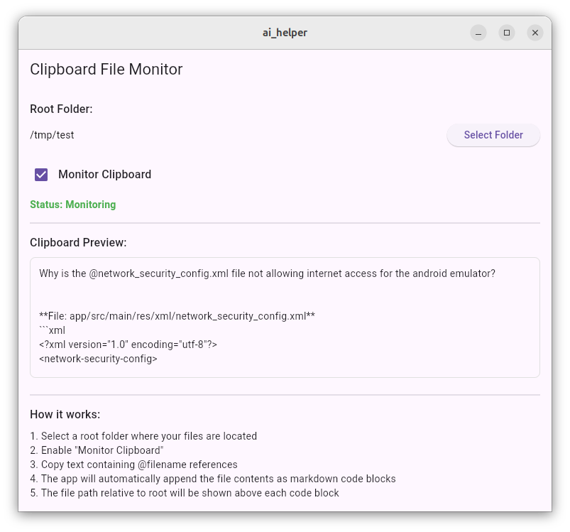

# AI Clipboard Helper

A helper app to create more context for AI coding assistants.

## Overview

This project is a super simple helper tool that lets me communicate with Codeium and Gemini
in parallel. 

The main problem with Gemini in Android Studio is that it is missing the context of the files
and Codeium has a nice feature to add the context of the files by mentioning them with @file.dart.

All this project does is monitoring the clipboard to find the @file.dart pattern and then take
the content of that file and add it to the clipboard.

## Usage

* Open the app and select a root folder where your files are located.
* Then start the monitoring by clicking the start button.
* Copy Codeium text containing @filename references.
* The app will look for the file and add its content to the clipboard.
* Paste the content into Gemini. 

## License

MIT